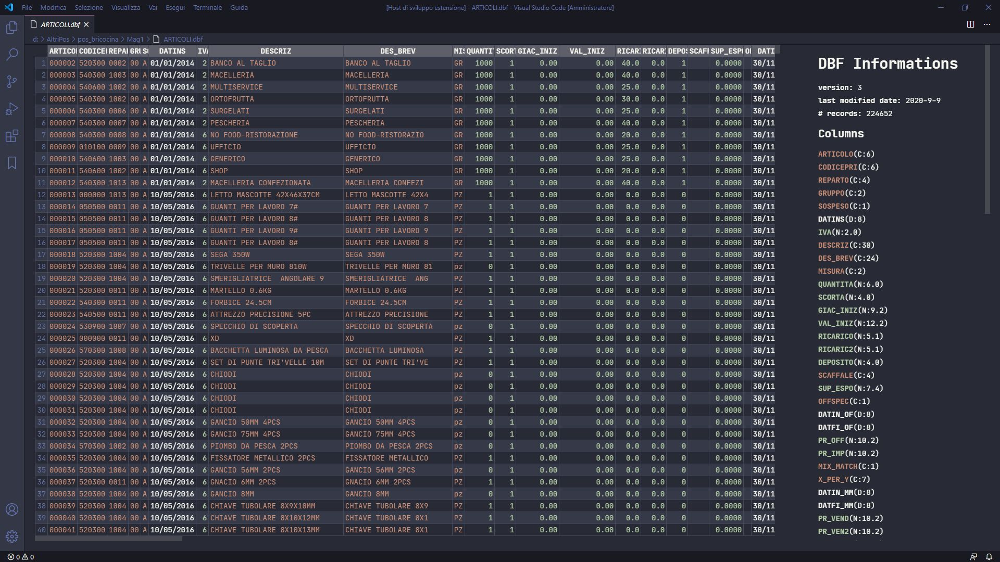
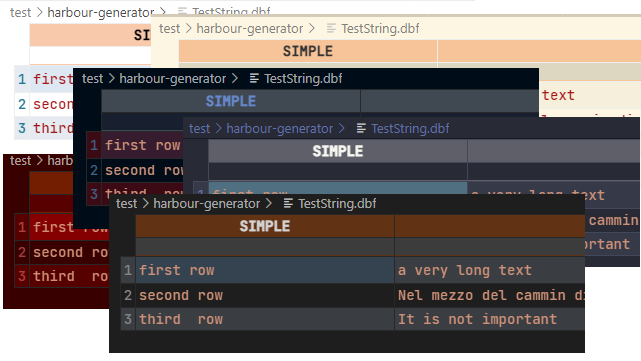
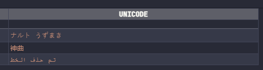
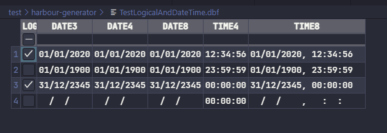
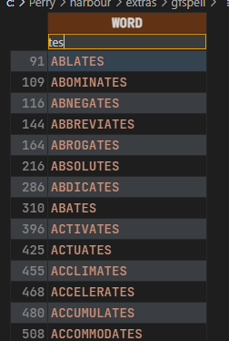
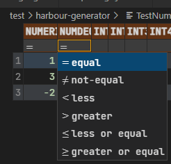
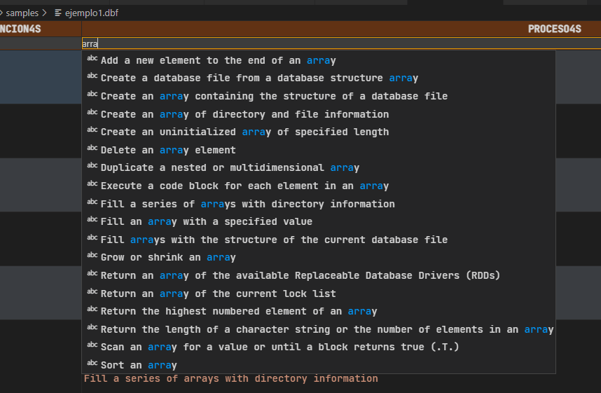

# DBF table viewer for VSCode

This extension allow to view  ~~and edit~~ DBF table file file, usually created with Clipper, Harbour or Visual Fox Pro.

## Features

 * Support for very big file
 * Support for unicode columns and different encoding [#2](https://github.com/APerricone/vscode-dbf/issues/2)
 * Sorting
 * Filtering

## Todo

 * cell selection
 * Copy
 * Structure code creation
 * Range selection

## Screenshot

### Support for all themes:

### Unicode columns:

### All types of date time:

### Filters:

Different filter for numeric columns:

Auto completation for text columns:

